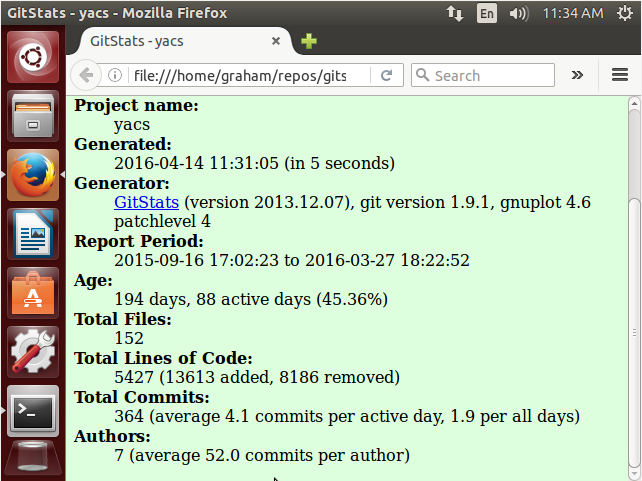

| Name | #Contributors | #Lines | First Commit | Last Commit |
|------|---------------|--------|---------------|--------------|
|YACS|7|5427|Create README.md|Added unfinished handlebars templates file|
|FullScreenPokemon|3|410509|Create README.md|Changed all instances of var to let|
|Chrometana|2|16439|Create README.md|jshint linting config and linting fixes|
|RPI Plan of Study|3|N/A|N/A|N/A|
|neptune|2|10200|Create README.md|Merge branch 'master' of https://github.com/sarbos/neptune|
 

The information gitstats gives matches what I found, however gitstats provides many more statistics such as commits per week, average commits per author, average file size, etc. 
